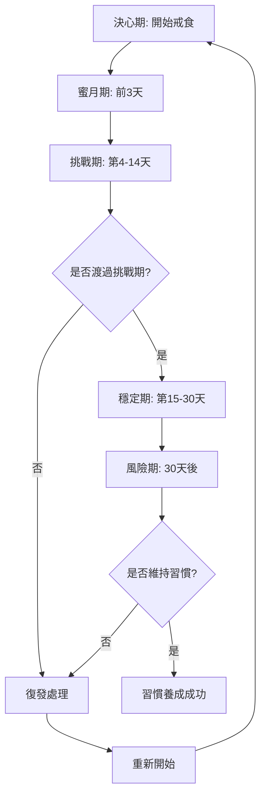

# Cheese-Thief 商業需求分析文檔
> Business Analyst: Requirements Analysis & User Stories
>
> 專案: Cheese-Thief - 戒食習慣養成 App
>
> 技術棧: Flutter 3.x + Supabase + Riverpod
>
> 文檔版本: v1.0
>
> 更新日期: 2026-02-12

---

## 目錄
1. [專案概述](#專案概述)
2. [目標用戶畫像](#目標用戶畫像)
3. [用戶旅程圖](#用戶旅程圖)
4. [User Stories](#user-stories)
5. [Edge Cases](#edge-cases)
6. [功能優先級 (MoSCoW)](#功能優先級-moscow)
7. [驗收準則](#驗收準則)
8. [業務指標](#業務指標)

---

## 專案概述

### 業務目標
Cheese-Thief 是一款專注於幫助用戶戒除不健康飲食習慣的 Flutter App，採用正向心理學設計，透過每日打卡、渴望管理、成就系統等功能，協助用戶建立健康飲食習慣。

### 核心價值主張
- **專注食物戒除**: 非通用戒癮 App，針對食物戒除場景深度優化
- **正向心理設計**: 不責備、不懲罰，而是鼓勵與支持
- **離線優先**: 隨時可用，不受網路限制
- **繁中本地化**: 台灣用戶優先，語言與文化貼近

### 差異化競爭優勢
| 競品 | Cheese-Thief 優勢 |
|------|--------------|
| I Am Sober | 更現代化的 UI/UX，專注食物場景 |
| Nomo | 更簡單易用，學習曲線平緩 |
| Quit That! | 功能豐富度更高，社群支持 |
| Habitica | 專注戒除而非養成，心理學基礎 |

---

## 目標用戶畫像

### Persona 1: 健康追求者 Amy (40%)
**基本資訊**
- 年齡: 28 歲
- 職業: 軟體工程師
- 收入: 中高收入
- 居住地: 台北市

**目標與動機**
- 想要戒除甜食以減重 5-10 公斤
- 希望透過數據追蹤看到進步
- 需要系統化的追蹤工具

**痛點**
- 現有 App 多為英文，不夠親切
- 缺乏針對「食物」的專業工具
- 復發後感到羞愧，需要正向鼓勵

**技術熟練度**: 高
**付費意願**: 中高 (願意付費購買 Premium)
**使用情境**: 每日早晨打卡、感到渴望時記錄

### Persona 2: 情緒性進食者 Brian (35%)
**基本資訊**
- 年齡: 35 歲
- 職業: 行銷企劃
- 收入: 中等收入
- 居住地: 新北市

**目標與動機**
- 控制壓力性進食（炸雞、泡麵）
- 需要情感支持與陪伴
- 希望找到替代應對策略

**痛點**
- 壓力大時會失控吃垃圾食物
- 缺乏即時的情緒支持
- 復發後容易放棄

**技術熟練度**: 中
**付費意願**: 中
**使用情境**: 壓力大時尋求支援、記錄渴望與應對策略

### Persona 3: 健康必須者 Carol (25%)
**基本資訊**
- 年齡: 42 歲
- 職業: 會計師
- 收入: 中高收入
- 疾病: 糖尿病前期

**目標與動機**
- 醫生建議戒除含糖飲料
- 健康理由，必須戒除
- 需要長期追蹤與紀錄

**痛點**
- 需要嚴格監控飲食
- 希望能匯出報告給醫生看
- 擔心復發影響健康

**技術熟練度**: 中低
**付費意願**: 高（健康無價）
**使用情境**: 每日固定時間打卡、定期檢視統計報告

---

## 用戶旅程圖

### 完整戒食心理歷程



### 階段詳細說明

#### 1. 決心期（第 0 天）
**用戶心理**: 動機強烈、充滿決心
**系統支持**:
- 簡單明確的開始流程
- 設定戒食目標（選擇要戒除的食物）
- 設定開始日期
- 選擇性設定提醒

**關鍵互動**:
```
用戶進入 App → 選擇「開始新的戒食旅程」→
輸入要戒除的食物 → 選擇開始日期 → 完成設定
```

#### 2. 蜜月期（第 1-3 天）
**用戶心理**: 動力充足、新鮮感強
**系統支持**:
- 每日打卡功能
- 即時慶祝動畫
- 解鎖「第一步」成就

**關鍵互動**: 每日早晨推播提醒打卡

#### 3. 挑戰期（第 4-14 天）
**用戶心理**: 渴望開始出現、意志力考驗
**系統支持**:
- 渴望記錄功能
- 應對策略建議
- 解鎖「堅持三天」「一週達人」成就
- 社群支持功能

**關鍵互動**: 「渴望來襲」快速按鈕隨時可觸及

#### 4. 穩定期（第 15-30 天）
**用戶心理**: 習慣逐漸養成、信心增加
**系統支持**:
- 統計圖表顯示進步
- 解鎖「半月之星」「月度冠軍」成就
- 分享功能（可選）

#### 5. 風險期（30 天後）
**用戶心理**: 可能鬆懈、需要持續動力
**系統支持**:
- 長期統計與趨勢
- 進階成就系統
- 社群導師配對（Premium+）

#### 6. 復發處理
**用戶心理**: 挫折感、可能放棄
**系統支持**:
- 正向鼓勵文案（「重新開始也是勇氣」）
- 保留歷史資料
- 允許立即開始新旅程
- 復發分析（辨識觸發因素）

---

## User Stories

### 功能域一: 戒食追蹤 (Journey Tracking)

#### US-001: 開始新的戒食旅程
**As a** 想要戒除不健康食物的用戶
**I want** 能夠快速開始一個戒食旅程
**So that** 我可以立即開始追蹤我的戒食進度

**Acceptance Criteria:**
- [ ] Given 我是已登入用戶，When 我點擊「開始新旅程」，Then 我應該看到戒食設定表單
- [ ] Given 我在填寫表單，When 我輸入要戒除的食物名稱（例如「甜食」），Then 系統應該接受並儲存
- [ ] Given 我選擇開始日期，When 我選擇今天或過去的日期，Then 系統應該正確計算戒食天數
- [ ] Given 我完成設定，When 我點擊「開始」，Then 旅程應該建立並顯示在首頁

**Edge Cases:**
- EC-1: 用戶選擇的開始日期是過去日期（例如 3 天前）
- EC-2: 用戶選擇的開始日期是未來日期（應該不允許）
- EC-3: 用戶已有進行中的旅程，再次點擊「開始新旅程」

**Priority:** P0 (Must Have)
**Effort:** M

---

#### US-002: 查看當前戒食天數
**As a** 正在戒食的用戶
**I want** 在首頁清楚看到我已經戒除多少天
**So that** 我能感受到成就感並保持動力

**Acceptance Criteria:**
- [ ] Given 我有進行中的旅程，When 我打開 App，Then 首頁應該顯示「已堅持 X 天」
- [ ] Given 今天是開始日，When 我查看天數，Then 應該顯示「第 1 天」（不是第 0 天）
- [ ] Given 跨過午夜，When 新的一天開始，Then 天數應該自動 +1
- [ ] Given 我在不同時區旅行，When 我查看天數，Then 應該基於本地時區計算

**Edge Cases:**
- EC-4: 用戶在跨時區旅行時（例如從台灣飛往美國）
- EC-5: 用戶手機時間不正確（例如被手動調整）
- EC-6: 跨過午夜 00:00:00 的瞬間，App 剛好開啟

**Priority:** P0 (Must Have)
**Effort:** S

---

#### US-003: 結束當前旅程（復發處理）
**As a** 不幸復發的用戶
**I want** 能夠誠實記錄復發，並得到正向鼓勵
**So that** 我不會因為羞愧而放棄，能夠重新開始

**Acceptance Criteria:**
- [ ] Given 我有進行中的旅程，When 我點擊「記錄復發」，Then 系統應該詢問確認
- [ ] Given 我確認復發，When 系統處理，Then 當前旅程應該標記為結束（設定 end_date 和 end_reason）
- [ ] Given 旅程結束後，When 我回到首頁，Then 應該看到正向鼓勵文案（例如「重新開始也是勇氣」）
- [ ] Given 我復發後，When 我查看歷史，Then 過去的旅程資料應該被保留（供統計分析）
- [ ] Given 我復發後，When 我想再試一次，Then 系統應該允許我立即開始新旅程

**Edge Cases:**
- EC-7: 用戶誤點「記錄復發」（需要確認機制）
- EC-8: 用戶在離線狀態下記錄復發
- EC-9: 用戶連續多次復發（例如 3 次以內）

**Priority:** P0 (Must Have)
**Effort:** M

---

### 功能域二: 每日打卡 (Daily Check-in)

#### US-004: 快速每日打卡
**As a** 每天使用 App 的用戶
**I want** 能夠用最少的步驟完成打卡
**So that** 打卡不會成為負擔，我能長期堅持

**Acceptance Criteria:**
- [ ] Given 我今天還沒打卡，When 我打開 App 首頁，Then 應該有明顯的「今日打卡」按鈕
- [ ] Given 我點擊打卡按鈕，When 我選擇心情（great/good/okay/tough/struggling），Then 打卡應該立即完成
- [ ] Given 打卡完成後，When 系統回應，Then 應該有慶祝動畫或正向回饋
- [ ] Given 我今天已打卡，When 我再次打開 App，Then 打卡按鈕應該顯示為「已完成」狀態

**Edge Cases:**
- EC-10: 用戶在離線狀態下打卡
- EC-11: 用戶在同一天內多次打卡（應該只記錄一次）
- EC-12: 用戶在 23:59 打卡後，00:00 立即又打卡

**Priority:** P0 (Must Have)
**Effort:** M

---

#### US-005: 補打卡功能
**As a** 偶爾忘記打卡的用戶
**I want** 能夠補前幾天的打卡
**So that** 我的記錄能夠保持完整

**Acceptance Criteria:**
- [ ] Given 我忘記打卡，When 我查看日曆，Then 應該看到未打卡的日期
- [ ] Given 我選擇過去的日期，When 我補打卡，Then 系統應該允許補打卡（限制 3 天內）
- [ ] Given 我補打卡時，When 系統處理，Then 應該標記為「補打卡」（與當日打卡區分）
- [ ] Given 我補打卡超過 3 天，When 我嘗試，Then 系統應該提示無法補打卡

**Edge Cases:**
- EC-13: 用戶嘗試補打卡超過 3 天前的日期
- EC-14: 用戶嘗試補打卡未來的日期
- EC-15: 用戶對同一天進行多次補打卡

**Priority:** P1 (Should Have)
**Effort:** M

---

### 功能域三: 渴望管理 (Craving Management)

#### US-006: 記錄渴望來襲
**As a** 突然感到強烈渴望的用戶
**I want** 能夠快速記錄當下的渴望
**So that** 我能透過記錄來降低衝動，並獲得支援

**Acceptance Criteria:**
- [ ] Given 我感到渴望，When 我點擊首頁的「渴望來襲」按鈕，Then 應該快速進入渴望記錄畫面
- [ ] Given 我在記錄渴望，When 我滑動強度條（1-10），Then 應該即時顯示對應的文字描述
- [ ] Given 我選擇觸發因素，When 我從預設選項選擇（壓力/無聊/社交/悲傷/疲勞/習慣時間），Then 應該被記錄
- [ ] Given 我記錄完成後，When 我提交，Then 系統應該提供即時的應對策略建議

**Edge Cases:**
- EC-16: 用戶輸入強度值為 0 或 11（超出 1-10 範圍）
- EC-17: 用戶在同一小時內記錄多次渴望
- EC-18: 用戶在離線狀態下記錄渴望

**Priority:** P0 (Must Have)
**Effort:** M

---

#### US-007: 查看渴望歷史與趨勢
**As a** 想要了解自己渴望模式的用戶
**I want** 能夠查看渴望的歷史記錄與統計
**So that** 我能識別觸發因素並提前預防

**Acceptance Criteria:**
- [ ] Given 我有渴望記錄，When 我進入統計頁面，Then 應該看到渴望次數的時間趨勢圖
- [ ] Given 我查看統計，When 系統分析，Then 應該顯示最常見的觸發因素（Top 3）
- [ ] Given 我查看統計，When 系統分析，Then 應該顯示平均渴望強度
- [ ] Given 我是免費用戶，When 我查看歷史，Then 應該只能看到最近 7 天的記錄

**Edge Cases:**
- EC-19: 用戶渴望記錄數量為 0
- EC-20: 用戶所有渴望都選擇同一個觸發因素
- EC-21: 用戶的渴望強度都是極端值（全是 1 或全是 10）

**Priority:** P1 (Should Have)
**Effort:** L

---

#### US-008: 成功抵抗渴望記錄
**As a** 成功克服渴望的用戶
**I want** 能夠記錄我如何成功抵抗
**So that** 我能累積有效的應對策略，並獲得成就感

**Acceptance Criteria:**
- [ ] Given 我記錄渴望時，When 我選擇「已成功抵抗」，Then 系統應該詢問我使用的應對策略
- [ ] Given 我選擇應對策略，When 我從預設選項選擇（喝水/散步/深呼吸/找人聊天/其他活動），Then 應該被記錄
- [ ] Given 我成功抵抗後，When 記錄完成，Then 應該獲得正向鼓勵（例如「太棒了！你做到了」）
- [ ] Given 我成功抵抗 10 次，When 系統檢查，Then 應該解鎖「渴望剋星」成就

**Edge Cases:**
- EC-22: 用戶選擇「已成功抵抗」但未填寫應對策略
- EC-23: 用戶在短時間內（例如 5 分鐘）重複記錄抵抗

**Priority:** P0 (Must Have)
**Effort:** M

---

### 功能域四: 成就系統 (Achievement System)

#### US-009: 自動解鎖里程碑成就
**As a** 達成特定天數的用戶
**I want** 系統自動解鎖成就徽章
**So that** 我能獲得即時的成就感與動力

**Acceptance Criteria:**
- [ ] Given 我完成第 1 天，When 系統檢查，Then 應該解鎖「第一步」成就
- [ ] Given 我完成第 3 天，When 系統檢查，Then 應該解鎖「堅持三天」成就
- [ ] Given 我完成第 7 天，When 系統檢查，Then 應該解鎖「一週達人」成就
- [ ] Given 我完成第 14 天，When 系統檢查，Then 應該解鎖「半月之星」成就
- [ ] Given 我完成第 30 天，When 系統檢查，Then 應該解鎖「月度冠軍」成就
- [ ] Given 成就解鎖時，When 我在使用 App，Then 應該有彈出式慶祝動畫

**Edge Cases:**
- EC-24: 用戶在離線狀態下達成成就（稍後同步時解鎖）
- EC-25: 用戶復發後重新開始，成就不應該重複解鎖
- EC-26: 用戶在 App 關閉時達成成就（下次打開時補發通知）

**Priority:** P0 (Must Have)
**Effort:** M

---

#### US-010: 查看成就收藏館
**As a** 想要回顧自己進步的用戶
**I want** 能夠查看所有已解鎖與未解鎖的成就
**So that** 我能看到自己的成長歷程，並設定下一個目標

**Acceptance Criteria:**
- [ ] Given 我進入成就頁面，When 頁面載入，Then 應該顯示所有成就（已解鎖與未解鎖）
- [ ] Given 我查看已解鎖成就，When 我點擊，Then 應該顯示解鎖日期與相關資訊
- [ ] Given 我查看未解鎖成就，When 我點擊，Then 應該顯示解鎖條件與當前進度
- [ ] Given 我有多個旅程，When 我查看成就，Then 應該顯示跨旅程的累計統計

**Edge Cases:**
- EC-27: 用戶是新用戶，沒有任何已解鎖成就
- EC-28: 用戶已解鎖所有成就
- EC-29: 用戶的成就資料在不同裝置間同步

**Priority:** P1 (Should Have)
**Effort:** M

---

### 功能域五: 社群支持 (Community Support)

#### US-011: 分享戒食進度（可選）
**As a** 想要激勵他人的用戶
**I want** 能夠將我的戒食進度分享到社群
**So that** 我能激勵其他人，並獲得社群的支持

**Acceptance Criteria:**
- [ ] Given 我達成里程碑，When 我選擇分享，Then 應該生成美觀的分享圖片
- [ ] Given 分享圖片生成，When 我點擊分享，Then 應該能選擇分享到社交平台（FB/IG/LINE）
- [ ] Given 我分享時，When 我選擇，Then 應該能選擇是否顯示具體戒除的食物名稱（隱私保護）
- [ ] Given 我分享後，When 其他用戶看到，Then 應該包含 Cheese-Thief 的下載連結（推薦機制）

**Edge Cases:**
- EC-30: 用戶設備未安裝任何社交平台 App
- EC-31: 用戶網路狀況不佳，分享圖片生成失敗
- EC-32: 用戶連續多次分享同一個成就

**Priority:** P2 (Could Have)
**Effort:** L

---

#### US-012: 查看社群動態牆（Premium）
**As a** Premium 用戶
**I want** 能夠看到其他用戶的匿名戒食動態
**So that** 我能獲得社群支持與陪伴感

**Acceptance Criteria:**
- [ ] Given 我是 Premium 用戶，When 我進入社群頁面，Then 應該看到其他用戶的匿名動態
- [ ] Given 我查看動態，When 動態顯示，Then 應該包含用戶暱稱（匿名）、戒食天數、心情分享
- [ ] Given 我看到鼓舞人心的動態，When 我點擊愛心，Then 應該能給予鼓勵（點讚）
- [ ] Given 我是免費用戶，When 我進入社群頁面，Then 應該看到升級 Premium 的提示

**Edge Cases:**
- EC-33: 社群動態為空（沒有其他用戶分享）
- EC-34: 用戶在離線狀態下查看社群（應顯示快取資料）
- EC-35: 用戶看到不當內容（需要檢舉機制）

**Priority:** P2 (Could Have)
**Effort:** XL

---

### 功能域六: 用戶設定與個人化

#### US-013: 設定每日提醒
**As a** 容易忘記打卡的用戶
**I want** 能夠設定每日提醒通知
**So that** 我不會忘記每天打卡

**Acceptance Criteria:**
- [ ] Given 我進入設定頁面，When 我開啟「每日提醒」，Then 應該能選擇提醒時間
- [ ] Given 我設定提醒時間為早上 8:00，When 時間到達，Then 應該收到本地推播通知
- [ ] Given 我今天已打卡，When 提醒時間到達，Then 不應該再收到提醒
- [ ] Given 我關閉提醒，When 我保存設定，Then 應該停止發送通知

**Edge Cases:**
- EC-36: 用戶未授予 App 推播通知權限
- [ ] EC-37: 用戶設定多個提醒時間
- EC-38: 用戶手機處於勿擾模式

**Priority:** P1 (Should Have)
**Effort:** M

---

#### US-014: 匯出戒食報告（Premium）
**As a** Premium 用戶（特別是因健康原因戒食者）
**I want** 能夠匯出我的戒食報告
**So that** 我能提供給醫生或營養師參考

**Acceptance Criteria:**
- [ ] Given 我是 Premium 用戶，When 我進入報告頁面，Then 應該有「匯出報告」按鈕
- [ ] Given 我點擊匯出，When 系統處理，Then 應該生成 PDF 格式的報告
- [ ] Given 報告生成，When 我查看內容，Then 應該包含戒食天數、打卡記錄、渴望統計、成就列表
- [ ] Given 報告完成，When 我選擇分享，Then 應該能透過 Email 或其他方式傳送

**Edge Cases:**
- EC-39: 用戶資料量過大（例如超過 1 年的記錄）
- EC-40: 用戶在離線狀態下嘗試匯出報告
- EC-41: 用戶匯出報告時資料不完整（例如正在同步）

**Priority:** P2 (Could Have)
**Effort:** L

---

## Edge Cases

### 類別一: 日期與時間計算

#### EC-1: 開始日期設定為過去日期
**情境**: 用戶實際從 3 天前開始戒食，現在才下載 App
**預期行為**:
- 允許用戶選擇過去日期（限制 30 天內）
- 系統正確計算當前戒食天數
- 顯示提示：「將從 X 天前開始計算」

**測試案例**:
```
Given: 今天是 2026-02-12
When: 用戶選擇開始日期為 2026-02-09
Then: 系統應顯示「已堅持 4 天」（2/9 算第 1 天）
```

---

#### EC-2: 開始日期設定為未來日期
**情境**: 用戶誤選或想要預約開始
**預期行為**:
- 不允許選擇未來日期
- 顯示錯誤提示：「開始日期不能晚於今天」
- 自動重設為今天

---

#### EC-4: 跨時區旅行
**情境**: 用戶從台灣（GMT+8）飛往美國（GMT-8）
**預期行為**:
- 使用手機本地時區計算日期
- 跨時區後，戒食天數仍然正確
- 打卡記錄使用本地日期儲存

**測試案例**:
```
Given: 用戶在台灣時間 2026-02-12 23:00 打卡（第 5 天）
When: 用戶飛到美國，本地時間變為 2026-02-12 07:00（同一天）
Then: 戒食天數仍顯示「第 5 天」，且不能重複打卡
```

---

#### EC-5: 手機時間不正確
**情境**: 用戶手動調整手機時間
**預期行為**:
- 檢測手機時間與伺服器時間差異
- 如果差異超過 24 小時，顯示警告
- 建議用戶校正時間

---

#### EC-6: 跨午夜瞬間
**情境**: 用戶在 23:59:59 打開 App，然後 00:00:00 時仍在使用
**預期行為**:
- App 即時更新戒食天數（+1）
- 昨天的打卡狀態變為「已完成」
- 今天的打卡狀態變為「待完成」

---

### 類別二: 渴望強度邊界

#### EC-16: 渴望強度超出範圍（0 或 11）
**情境**: 用戶輸入或 UI 元件產生異常值
**預期行為**:
- 前端驗證：強度滑桿限制在 1-10
- 後端驗證：拒絕 <1 或 >10 的值
- 錯誤提示：「請選擇 1-10 之間的強度」

**測試案例**:
```dart
test('渴望強度必須在 1-10 之間', () {
  expect(() => Craving(intensity: 0), throwsValidationError);
  expect(() => Craving(intensity: 11), throwsValidationError);
  expect(() => Craving(intensity: 1), returnsNormally);
  expect(() => Craving(intensity: 10), returnsNormally);
});
```

---

#### EC-17: 同一小時內多次記錄渴望
**情境**: 用戶在短時間內（例如 10 分鐘）記錄多次渴望
**預期行為**:
- 允許記錄（因為渴望可能真的多次出現）
- 但在統計時，提示「此時段渴望頻繁」
- 建議用戶尋求專業協助

---

### 類別三: 離線情況處理

#### EC-10: 離線打卡
**情境**: 用戶在無網路環境（例如地下室）打卡
**預期行為**:
- 打卡資料儲存在本地資料庫（Hive/Drift）
- 標記為「待同步」狀態
- 顯示離線圖示提示
- 網路恢復後，自動背景同步

**測試案例**:
```dart
test('離線打卡應儲存至本地', () async {
  // 模擬離線
  when(connectivity.isOnline).thenReturn(false);

  await checkinUseCase.checkin(date: today);

  // 驗證本地儲存
  final localCheckin = await localDb.getCheckin(today);
  expect(localCheckin.syncStatus, SyncStatus.pending);
});
```

---

#### EC-18: 離線記錄渴望
**情境**: 用戶在無網路環境記錄渴望
**預期行為**: 同 EC-10，本地儲存並稍後同步

---

#### EC-34: 離線查看社群
**情境**: 用戶在無網路環境進入社群頁面
**預期行為**:
- 顯示快取的社群動態（最多 24 小時）
- 顯示「離線模式」提示
- 禁用點讚、留言等互動功能

---

### 類別四: 復發與重新開始

#### EC-7: 誤點「記錄復發」
**情境**: 用戶手滑或誤觸
**預期行為**:
- 顯示二次確認對話框
- 對話框文案：「確定要結束當前旅程嗎？此操作無法復原。」
- 提供「取消」和「確定」按鈕

---

#### EC-9: 連續多次復發
**情境**: 用戶在 3 天內連續復發 3 次
**預期行為**:
- 記錄所有歷史旅程
- 第 3 次復發後，顯示額外關懷
- 提示：「戒食不易，要不要試試降低目標？例如先從『減少頻率』開始」
- 提供專業資源連結（營養師、心理諮商）

---

#### EC-25: 復發後成就不重複解鎖
**情境**: 用戶第一次旅程達成「一週達人」，復發後重新開始第二次旅程，再次達到第 7 天
**預期行為**:
- 成就系統檢查：該成就已解鎖，不重複解鎖
- 但統計頁面應顯示：「這是你第 2 次達成 7 天目標」
- 提供不同層級的成就：「一週達人 x2」、「一週達人 x3」

---

### 類別五: 打卡邊界

#### EC-11: 同一天多次打卡
**情境**: 用戶在早上 8:00 打卡後，晚上 20:00 又打卡
**預期行為**:
- 系統檢查：該日期已有打卡記錄
- 詢問用戶：「您今天已經打卡，要更新心情嗎？」
- 允許更新心情與備註，但不重複計數

---

#### EC-12: 跨午夜連續打卡
**情境**: 用戶在 23:59 打卡（第 5 天），00:01 又打卡（第 6 天）
**預期行為**:
- 允許打卡（因為已是新的一天）
- 正確計算天數（第 6 天）
- 不視為異常行為

---

#### EC-13: 補打卡超過 3 天
**情境**: 用戶想補 5 天前的打卡
**預期行為**:
- 系統拒絕補打卡
- 提示：「只能補打卡 3 天內的記錄」
- 建議：「如果長期沒打卡，建議重新開始旅程」

---

#### EC-15: 重複補打卡
**情境**: 用戶對同一天進行多次補打卡
**預期行為**: 同 EC-11，允許更新但不重複計數

---

### 類別六: 成就系統

#### EC-24: 離線達成成就
**情境**: 用戶在離線狀態下打卡，達成第 7 天（應解鎖「一週達人」）
**預期行為**:
- 本地檢查成就條件，標記為「待解鎖」
- 網路恢復後，同步至伺服器並正式解鎖
- 下次打開 App 時，補發成就通知

---

#### EC-26: App 關閉時達成成就
**情境**: 用戶在午夜 00:00 達成第 7 天，但 App 已關閉
**預期行為**:
- 下次打開 App 時，檢查並解鎖成就
- 顯示慶祝動畫
- 發送本地通知（如果用戶開啟通知）

---

#### EC-28: 已解鎖所有成就
**情境**: 高度活躍用戶已解鎖所有成就
**預期行為**:
- 顯示「成就大師」特殊徽章
- 提示：「您已解鎖所有成就！敬請期待更多挑戰」
- 定期更新新的成就（由產品團隊規劃）

---

### 類別七: 資料同步

#### EC-29: 跨裝置資料同步
**情境**: 用戶在 iPhone 上打卡，然後在 iPad 上查看
**預期行為**:
- 使用 Supabase Realtime 即時同步
- iPad 上立即顯示最新的打卡狀態
- 如果 iPad 離線，下次連線時自動同步

---

#### EC-41: 匯出報告時資料不完整
**情境**: 用戶在資料同步中途匯出報告
**預期行為**:
- 檢查同步狀態
- 如果有「待同步」資料，提示：「部分資料尚未同步，報告可能不完整」
- 提供選項：「等待同步完成」或「仍要匯出」

---

### 類別八: 隱私與安全

#### EC-32: 連續多次分享同一成就
**情境**: 用戶對同一個成就連續分享 5 次
**預期行為**:
- 允許分享（用戶自由）
- 但在分享圖片上加上時間戳記，避免誤導
- 如果分享次數 > 3 次，提示：「您已分享過此成就」

---

#### EC-35: 社群不當內容
**情境**: 用戶在社群動態中看到不當言論
**預期行為**:
- 提供「檢舉」按鈕
- 檢舉後，該內容對用戶隱藏
- 後台管理員審核，確認後刪除
- 嚴重違規者停權

---

## 功能優先級 (MoSCoW)

### Must Have (P0) - MVP 必備功能
> 這些功能是 Cheese-Thief 的核心價值，缺一不可。如果沒有這些功能，產品無法上線。

| 功能 | User Story | 理由 | 預估工時 |
|------|-----------|------|---------|
| 開始戒食旅程 | US-001 | 產品核心功能 | 5 天 |
| 查看戒食天數 | US-002 | 用戶主要價值 | 3 天 |
| 每日打卡 | US-004 | 持續參與關鍵 | 5 天 |
| 記錄渴望 | US-006 | 即時支援核心 | 8 天 |
| 成功抵抗記錄 | US-008 | 正向回饋機制 | 5 天 |
| 里程碑成就 | US-009 | 動力來源 | 8 天 |
| 復發處理 | US-003 | 人性化設計 | 5 天 |
| 用戶註冊登入 | - | 基礎功能 | 3 天 |
| 離線模式支援 | - | 隨時可用保證 | 10 天 |

**Must Have 小計**: 52 天（約 10-11 週，2-3 位開發者）

---

### Should Have (P1) - 重要但非關鍵
> 這些功能能顯著提升用戶體驗，應該在 V1.0 發布時包含，但如果時程緊迫可延後至 V1.1。

| 功能 | User Story | 理由 | 預估工時 |
|------|-----------|------|---------|
| 補打卡功能 | US-005 | 容錯機制 | 3 天 |
| 渴望歷史統計 | US-007 | 自我洞察 | 8 天 |
| 成就收藏館 | US-010 | 成就感展示 | 5 天 |
| 每日提醒設定 | US-013 | 留存率提升 | 3 天 |
| 心情趨勢圖表 | - | 數據可視化 | 5 天 |
| 個人資料編輯 | - | 基礎功能 | 2 天 |

**Should Have 小計**: 26 天（約 5-6 週）

---

### Could Have (P2) - 加分功能
> 這些功能能增加產品競爭力，但不影響核心體驗。可安排在 V1.2 或更晚版本。

| 功能 | User Story | 理由 | 預估工時 |
|------|-----------|------|---------|
| 分享進度 | US-011 | 病毒式傳播 | 5 天 |
| 社群動態牆 | US-012 | 社交支援 | 13 天 |
| 匯出報告 | US-014 | 專業用戶需求 | 5 天 |
| 自定義成就 | - | 個人化 | 8 天 |
| 深色模式 | - | 視覺體驗 | 3 天 |
| 多語言支援 | - | 市場擴展 | 8 天 |
| Widget 小工具 | - | 便利性 | 5 天 |

**Could Have 小計**: 47 天（約 9-10 週）

---

### Won't Have (此版本不做)
> 這些功能被明確排除在當前版本外，可能在未來考慮。

| 功能 | 理由 | 可能時機 |
|------|------|---------|
| AI 教練建議 | 技術複雜度高，需要大量訓練資料 | V2.0 |
| 1對1 導師配對 | 需要社群規模支撐，運營成本高 | V2.0 |
| 影片課程內容 | 內容製作成本高，非核心價值 | V3.0 |
| AR 食物辨識 | 技術難度高，MVP 不需要 | 未定 |
| 遊戲化皮膚商城 | 分散核心價值焦點 | 未定 |
| 多人挑戰賽 | 需要成熟社群基礎 | V2.0+ |

---

### 版本規劃建議

#### V1.0 (MVP) - 預估 3-4 個月
**目標**: 驗證核心價值假設，獲得種子用戶
**範圍**: Must Have 所有功能
**成功指標**:
- 500 個活躍用戶
- D7 留存率 > 30%
- NPS > 40

#### V1.1 - 預估 1.5-2 個月
**目標**: 提升用戶體驗，增加留存
**範圍**: Should Have 所有功能
**成功指標**:
- 2,000 個活躍用戶
- D7 留存率 > 40%
- 免費轉付費率 > 3%

#### V1.2 - 預估 2-3 個月
**目標**: 增加社交屬性，推動口碑傳播
**範圍**: Could Have 部分功能（優先 US-011, US-012）
**成功指標**:
- 5,000 個活躍用戶
- 分享率 > 15%
- K-factor > 0.3

---

## 驗收準則

### 功能驗收標準

每個 User Story 在標記為「完成」前，必須滿足以下條件：

#### 1. 功能完整性
- [ ] 所有 Acceptance Criteria 都通過測試
- [ ] 所有識別的 Edge Cases 都有對應處理
- [ ] 離線模式功能正常（如適用）
- [ ] 跨平台一致性（iOS/Android）

#### 2. 測試覆蓋率
- [ ] 單元測試覆蓋率 > 80%
- [ ] Widget 測試覆蓋關鍵 UI 流程
- [ ] Integration 測試覆蓋端到端場景
- [ ] 手動測試通過 QA 檢查清單

#### 3. 效能標準
- [ ] 冷啟動時間 < 2 秒
- [ ] 頁面切換動畫流暢（60 FPS）
- [ ] 離線操作響應時間 < 100ms
- [ ] 資料同步不阻塞 UI

#### 4. UI/UX 標準
- [ ] 符合 Material Design 3 規範
- [ ] 符合 Cheese-Thief 設計系統（色彩、字體、間距）
- [ ] 支援無障礙功能（TalkBack/VoiceOver）
- [ ] 支援不同螢幕尺寸（小螢幕、平板）

#### 5. 文案品質
- [ ] 所有文案使用正向語言（參考領域知識）
- [ ] 繁體中文用語正確、自然
- [ ] 無錯別字、語法錯誤
- [ ] 錯誤訊息清晰、可行動

#### 6. 資料安全
- [ ] 敏感資料加密儲存
- [ ] API 呼叫使用 HTTPS
- [ ] RLS (Row Level Security) 正確設定
- [ ] 符合 GDPR/個資法規範

---

### 特定功能驗收清單

#### 戒食天數計算 (US-002)
- [ ] 開始日當天算第 1 天（不是第 0 天）
- [ ] 跨午夜自動更新天數
- [ ] 跨時區計算正確（使用本地時區）
- [ ] 過去日期開始計算正確
- [ ] 閏年處理正確

**測試案例**:
```dart
test('開始日當天算第 1 天', () {
  final journey = QuitJourney(
    startDate: DateTime(2026, 2, 10),
  );
  final days = journey.calculateDays(
    now: DateTime(2026, 2, 10, 23, 59),
  );
  expect(days, 1);
});

test('跨午夜天數 +1', () {
  final journey = QuitJourney(
    startDate: DateTime(2026, 2, 10),
  );
  final days = journey.calculateDays(
    now: DateTime(2026, 2, 11, 0, 1),
  );
  expect(days, 2);
});
```

---

#### 渴望強度驗證 (US-006)
- [ ] 滑桿範圍限制在 1-10
- [ ] 拖曳滑桿時即時更新文字描述
- [ ] 後端拒絕 <1 或 >10 的值
- [ ] 顯示對應的圖示/顏色

**測試案例**:
```dart
testWidgets('渴望滑桿範圍 1-10', (tester) async {
  await tester.pumpWidget(CravingIntensitySlider());

  final slider = find.byType(Slider);
  expect(tester.widget<Slider>(slider).min, 1);
  expect(tester.widget<Slider>(slider).max, 10);
});
```

---

#### 離線打卡 (US-004)
- [ ] 離線時打卡儲存至本地
- [ ] 顯示「待同步」狀態圖示
- [ ] 網路恢復後自動背景同步
- [ ] 同步失敗時重試機制（最多 3 次）
- [ ] 同步衝突處理（本地優先）

**測試案例**:
```dart
test('離線打卡本地儲存', () async {
  // 模擬離線
  when(connectivity.isOnline).thenReturn(false);

  await checkinUseCase.checkin(date: DateTime.now());

  final local = await localDb.getPendingCheckins();
  expect(local.length, 1);
  expect(local.first.syncStatus, SyncStatus.pending);
});
```

---

## 業務指標

### 北極星指標 (North Star Metric)
**週活躍打卡用戶數 (Weekly Active Checkin Users, WACU)**

定義: 過去 7 天內至少打卡 1 次的獨立用戶數

**為什麼選這個指標？**
1. 直接反映用戶參與度（打卡是核心行為）
2. 與留存率高度相關
3. 與商業價值相關（活躍用戶更可能付費）
4. 可行動、可影響（產品優化可直接提升）

**目標設定**:
- V1.0 (月 1): 100 WACU
- V1.0 (月 3): 500 WACU
- V1.1 (月 6): 2,000 WACU
- V1.2 (月 9): 5,000 WACU

---

### 關鍵績效指標 (KPIs)

#### 1. 獲取指標 (Acquisition)
| 指標 | 定義 | 目標 (V1.0) | 目標 (V1.2) |
|------|------|------------|------------|
| App 下載數 | 總下載次數 | 2,000 | 15,000 |
| 註冊轉化率 | 下載後完成註冊比例 | > 60% | > 70% |
| 新用戶開始旅程率 | 註冊後開始第一個旅程 | > 80% | > 85% |

#### 2. 活躍指標 (Activation)
| 指標 | 定義 | 目標 (V1.0) | 目標 (V1.2) |
|------|------|------------|------------|
| D1 打卡率 | 第一天完成打卡比例 | > 70% | > 80% |
| 首次渴望記錄率 | 7 天內至少記錄 1 次渴望 | > 40% | > 50% |
| Aha Moment 達成率 | 3 天內解鎖首個成就 | > 60% | > 70% |

#### 3. 留存指標 (Retention)
| 指標 | 定義 | 目標 (V1.0) | 目標 (V1.2) |
|------|------|------------|------------|
| D7 留存率 | 新用戶 7 天後回訪 | > 30% | > 40% |
| D30 留存率 | 新用戶 30 天後回訪 | > 15% | > 25% |
| 週打卡頻率 | 用戶每週平均打卡天數 | > 4 天 | > 5 天 |

#### 4. 商業指標 (Revenue)
| 指標 | 定義 | 目標 (V1.0) | 目標 (V1.2) |
|------|------|------------|------------|
| 免費轉付費率 | 免費用戶轉為 Premium | > 3% | > 5% |
| MRR (月經常性收入) | 每月訂閱收入 | $500 | $3,000 |
| ARPU | 每用戶平均收入 | $1.0 | $1.5 |
| LTV | 用戶生命週期價值 | $12 | $18 |

#### 5. 推薦指標 (Referral)
| 指標 | 定義 | 目標 (V1.0) | 目標 (V1.2) |
|------|------|------------|------------|
| NPS | 淨推薦值 | > 40 | > 50 |
| 分享率 | 達成成就後分享比例 | N/A | > 15% |
| K-factor | 病毒係數 | N/A | > 0.3 |

---

### 產品健康度指標

#### 用戶成功指標
| 指標 | 定義 | 目標 |
|------|------|------|
| 30 天成功率 | 達成 30 天戒食目標比例 | > 25% |
| 平均戒食天數 | 所有旅程的平均天數 | > 12 天 |
| 渴望抵抗成功率 | 記錄為「成功抵抗」比例 | > 60% |
| 復發重啟率 | 復發後 7 天內重啟比例 | > 40% |

#### 技術健康度指標
| 指標 | 定義 | 目標 |
|------|------|------|
| App Crash Rate | 崩潰率 | < 1% |
| API 成功率 | API 呼叫成功率 | > 99.5% |
| 同步延遲 | 離線資料同步平均時間 | < 5 秒 |
| 頁面載入時間 | P95 頁面載入時間 | < 2 秒 |

---

### 指標監控與儀表板

#### 每日監控
- WACU（週活躍打卡用戶數）
- DAU（日活躍用戶數）
- App Crash Rate
- API 錯誤率

#### 每週回顧
- D7 留存率
- 新用戶開始旅程率
- 週打卡頻率
- NPS

#### 每月複盤
- MRR 增長率
- 免費轉付費率
- 30 天成功率
- CAC vs LTV

---

## 附錄

### A. 資料模型快速參考

```dart
// 戒食旅程
class QuitJourney {
  final String id;
  final String userId;
  final String targetFood;      // 要戒除的食物
  final DateTime startDate;
  final DateTime? endDate;      // null = 進行中
  final String? endReason;      // 'relapse' / 'completed' / 'cancelled'
  final DateTime createdAt;
}

// 每日打卡
class DailyCheckin {
  final String id;
  final String journeyId;
  final String userId;
  final DateTime checkinDate;   // 只記錄日期部分
  final String mood;            // 'great'/'good'/'okay'/'tough'/'struggling'
  final String? note;
  final bool isBackfilled;      // 是否為補打卡
  final DateTime createdAt;
}

// 渴望記錄
class Craving {
  final String id;
  final String journeyId;
  final String userId;
  final int intensity;          // 1-10
  final String? trigger;        // 'stress'/'boredom'/'social'/'sadness'/'fatigue'/'habit_time'
  final String? copingStrategy; // 'water'/'walk'/'breathing'/'talk'/'distraction'
  final bool resisted;          // 是否成功抵抗
  final DateTime occurredAt;
}

// 成就
class Achievement {
  final String id;
  final String userId;
  final String achievementType; // 'first_day'/'three_days'/'one_week'/'two_weeks'/'one_month'/'first_resist'/'craving_master'/'streak_king'
  final DateTime unlockedAt;
  final Map<String, dynamic>? metadata;
}
```

---

### B. 正向語言文案參考

| 情境 | ❌ 避免使用 | ✅ 推薦使用 |
|------|-----------|-----------|
| 復發 | 你失敗了 | 重新開始也是勇氣 |
| 渴望 | 又想吃了？ | 渴望來襲，你可以的！ |
| 統計 | 失敗次數: 3 | 歷史旅程: 3 次挑戰 |
| 天數 | 還要堅持 X 天 | 已經堅持了 X 天 |
| 未打卡 | 你忘記打卡了！ | 別忘了記錄今天的進步 |
| 高強度渴望 | 危險！ | 這次挑戰有點大，但你能克服 |
| 多次復發 | 你一直失敗 | 每次重新開始都是新的學習 |
| 成就未達成 | 你還沒達成 | 再 X 天就能解鎖了！ |

---

### C. Supabase RLS 策略參考

```sql
-- quit_journeys 表的 RLS
CREATE POLICY "用戶只能查看自己的旅程"
ON quit_journeys FOR SELECT
USING (auth.uid() = user_id);

CREATE POLICY "用戶只能建立自己的旅程"
ON quit_journeys FOR INSERT
WITH CHECK (auth.uid() = user_id);

CREATE POLICY "用戶只能更新自己的旅程"
ON quit_journeys FOR UPDATE
USING (auth.uid() = user_id);

-- daily_checkins 表的 RLS
CREATE POLICY "用戶只能查看自己的打卡"
ON daily_checkins FOR SELECT
USING (auth.uid() = user_id);

CREATE POLICY "用戶只能建立自己的打卡"
ON daily_checkins FOR INSERT
WITH CHECK (auth.uid() = user_id);

-- cravings 表的 RLS (同上)
-- achievements 表的 RLS (同上)
```

---

### D. 關鍵風險與緩解措施

| 風險 | 影響 | 可能性 | 緩解措施 |
|------|------|-------|---------|
| 用戶留存率低於預期 | 高 | 中 | 1. 強化 onboarding 體驗<br>2. 增加每日提醒<br>3. 提早引入社群功能 |
| 免費轉付費率不足 | 高 | 中 | 1. 優化 paywall 設計<br>2. 提供試用期<br>3. 強化 Premium 價值溝通 |
| 技術債累積影響開發速度 | 中 | 高 | 1. 堅守 Clean Architecture<br>2. 維持測試覆蓋率 > 80%<br>3. 定期 Code Review |
| 離線同步機制複雜度高 | 中 | 中 | 1. 使用成熟的離線方案（Drift）<br>2. 簡化同步邏輯（本地優先）<br>3. 充分測試邊界情況 |
| 競品快速迭代超越 | 中 | 低 | 1. 專注差異化（正向心理、繁中優化）<br>2. 快速迭代 MVP<br>3. 緊密用戶反饋循環 |
| Supabase 成本超出預算 | 低 | 低 | 1. 監控資料庫用量<br>2. 優化查詢效能<br>3. 制定擴容計畫 |

---

## 文檔修訂歷史

| 版本 | 日期 | 修訂者 | 修訂內容 |
|------|------|--------|---------|
| v1.0 | 2026-02-12 | Business Analyst | 初版發布：完整需求分析、User Stories、Edge Cases、功能優先級、業務指標 |

---

## 相關文檔

- **技術架構**: `/docs/ARCHITECTURE.md`
- **UI/UX 設計系統**: `/docs/DESIGN_SYSTEM.md`
- **API 規格**: `/docs/API_SPEC.md`
- **測試策略**: `/docs/TEST_STRATEGY.md`
- **資料庫 Schema**: `/supabase/migrations/`
- **領域知識**: `/.claude/skills/cheese-thief-domain/README.md`

---

## 聯繫資訊

**Business Analyst**: @business-analyst
**Product Strategist**: @product-strategist
**Tech Lead**: @tech-lead

如有任何需求相關問題，請透過專案溝通頻道聯繫。

---

**END OF DOCUMENT**
